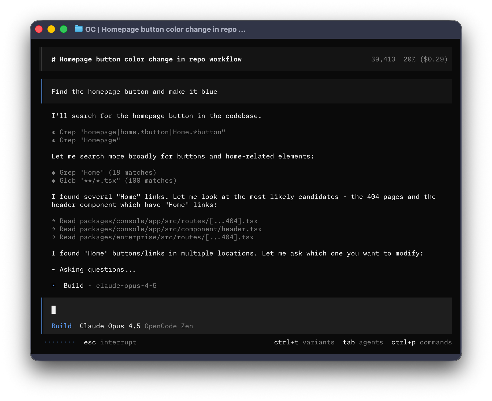

<p align="center">
  <a href="https://symbolic.computer">
    <picture>
      <source srcset="packages/console/app/src/asset/logo-ornate-dark.svg" media="(prefers-color-scheme: dark)">
      <source srcset="packages/console/app/src/asset/logo-ornate-light.svg" media="(prefers-color-scheme: light)">
      
    </picture>
  </a>
</p>
<p align="center">The open source AI coding agent.</p>
<p align="center">
  <a href="https://symbolic.computer/discord"></a>
  <a href="https://www.npmjs.com/package/symbolic-ai"></a>
  <a href="https://github.com/SymbolicOS/symbolic/actions/workflows/publish.yml"></a>
</p>

<p align="center">
  <a href="README.md">English</a> |
  <a href="README.zh.md">简体中文</a> |
  <a href="README.zht.md">繁體中文</a> |
  <a href="README.ko.md">한국어</a> |
  <a href="README.de.md">Deutsch</a> |
  <a href="README.es.md">Español</a> |
  <a href="README.fr.md">Français</a> |
  <a href="README.it.md">Italiano</a> |
  <a href="README.da.md">Dansk</a> |
  <a href="README.ja.md">日本語</a> |
  <a href="README.pl.md">Polski</a> |
  <a href="README.ru.md">Русский</a> |
  <a href="README.bs.md">Bosanski</a> |
  <a href="README.ar.md">العربية</a> |
  <a href="README.no.md">Norsk</a> |
  <a href="README.br.md">Português (Brasil)</a> |
  <a href="README.th.md">ไทย</a> |
  <a href="README.tr.md">Türkçe</a> |
  <a href="README.uk.md">Українська</a> |
  <a href="README.bn.md">বাংলা</a> |
  <a href="README.gr.md">Ελληνικά</a> |
  <a href="README.vi.md">Tiếng Việt</a>
</p>

[](https://symbolic.computer)

---

### Installation

```bash
# YOLO
curl -fsSL https://symbolic.computer/install | bash

# Package managers
npm i -g symbolic-ai@latest        # or bun/pnpm/yarn
scoop install symbolic             # Windows
choco install symbolic             # Windows
brew install anomalyco/tap/symbolic # macOS and Linux (recommended, always up to date)
brew install symbolic              # macOS and Linux (official brew formula, updated less)
sudo pacman -S symbolic            # Arch Linux (Stable)
paru -S symbolic-bin               # Arch Linux (Latest from AUR)
mise use -g symbolic               # Any OS
nix run nixpkgs#symbolic           # or github:SymbolicOS/symbolic for latest dev branch
```

> [!TIP]
> Remove versions older than 0.1.x before installing.
> Use the `symbolic` command after install.

### Desktop App (BETA)

Symbolic is also available as a desktop application. Download directly from the [releases page](https://github.com/SymbolicOS/symbolic/releases) or [symbolic.computer/download](https://symbolic.computer/download).

| Platform              | Download                              |
| --------------------- | ------------------------------------- |
| macOS (Apple Silicon) | `symbolic-desktop-darwin-aarch64.dmg` |
| macOS (Intel)         | `symbolic-desktop-darwin-x64.dmg`     |
| Windows               | `symbolic-desktop-windows-x64.exe`    |
| Linux                 | `.deb`, `.rpm`, or AppImage           |

```bash
# macOS (Homebrew)
brew install --cask symbolic-desktop
# Windows (Scoop)
scoop bucket add extras; scoop install extras/symbolic-desktop
```

#### Installation Directory

The install script respects the following priority order for the installation path:

1. `$SYMBOLIC_INSTALL_DIR` - Custom installation directory
2. `$XDG_BIN_DIR` - XDG Base Directory Specification compliant path
3. `$HOME/bin` - Standard user binary directory (if it exists or can be created)
4. `$HOME/.symbolic/bin` - Default fallback

```bash
# Examples
SYMBOLIC_INSTALL_DIR=/usr/local/bin curl -fsSL https://symbolic.computer/install | bash
XDG_BIN_DIR=$HOME/.local/bin curl -fsSL https://symbolic.computer/install | bash
```

### Agents

Symbolic includes two built-in agents you can switch between with the `Tab` key.

- **build** - Default, full-access agent for development work
- **plan** - Read-only agent for analysis and code exploration
  - Denies file edits by default
  - Asks permission before running bash commands
  - Ideal for exploring unfamiliar codebases or planning changes

Also included is a **general** subagent for complex searches and multistep tasks.
This is used internally and can be invoked using `@general` in messages.

Learn more about [agents](https://symbolic.computer/docs/agents).

### Documentation

For more info on how to configure Symbolic, [**head over to our docs**](https://symbolic.computer/docs).

### Contributing

If you're interested in contributing to Symbolic, please read our [contributing docs](./CONTRIBUTING.md) before submitting a pull request.

### Building on Symbolic

If you are working on a project that's related to Symbolic and is using "symbolic" as part of its name, please add a note to your README to clarify that it is not built by the Symbolic team and is not affiliated with us in any way.

### FAQ

#### How is this different from Claude Code?

It's very similar to Claude Code in terms of capability. Here are the key differences:

- 100% open source
- Not coupled to any provider. Although we recommend the models we provide through [Symbolic Zen](https://symbolic.computer/zen), Symbolic can be used with Claude, OpenAI, Google, or even local models. As models evolve, the gaps between them will close and pricing will drop, so being provider-agnostic is important.
- Out-of-the-box LSP support
- A focus on TUI. Symbolic is built by terminal-first users, and we are going to push the limits of what's possible in the terminal.
- A client/server architecture. This, for example, can allow Symbolic to run on your computer while you drive it remotely from a mobile app, meaning that the TUI frontend is just one of the possible clients.

---

**Join our community** [Discord](https://discord.gg/symbolic) | [X.com](https://x.com/symbolic)
